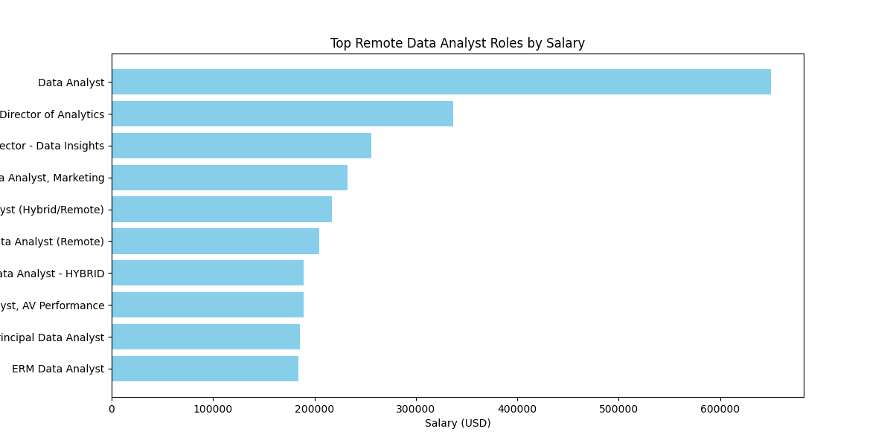

# Introduction
Focusing on data analyst roles, this project explores top-paying jobs, in-demand skills, and where high demand meets salary in data analytics.

See SQL queries here [project_sql folder](/project_sql/)

# Tools I Used

- **SQL:** the backbone of my analysis, allowing me to query the database and discover critical insights.
- **PostgreSQL:** The chosen database management system, ideal for handling the job posting data.
- **Visual Studio Code:** My go-to for database management and executing SQL queries.
- **Git and Github:** Essential for version control and sharing my SQL scripts and analysis, ensuring collaboration and project tracking.

# The Analysis
Each query for this project aimed at investigating specific aspects of the data analyst job market. Here's how I approaced each question:

### 1. Top Paying Data Analyst Jobs
To identify the highest-paying roles I filtered data analyst positions by average yearly salary and location, focusing on remote jobs

```sql
SELECT job_id,
    job_title,
    name AS company_name,
    job_location,
    job_schedule_type,
    salary_year_avg,
    job_posted_date
FROM job_postings_fact
    LEFT JOIN company_dim ON company_dim.company_id = job_postings_fact.company_id
WHERE job_title_short = 'Data Analyst'
    AND (
        job_work_from_home = TRUE
    )
    AND salary_year_avg IS NOT NULL
ORDER BY salary_year_avg DESC
LIMIT 10;
```
✨ ***Key Insights:***

- Mantys is a clear outlier with a massive $650K salary — worth verifying if it’s a high-level role or anomaly.
- Big tech and telecom companies (Meta, AT&T, Pinterest) are offering highly competitive salaries in the $230K–$336K range.
- SmartAsset appears twice with high-paying Principal Data Analyst roles — potentially signaling growth or a strong data team.
- Even the "lowest" salaries here are $184K, which is well above the market average for Data Analysts — indicating these roles likely require seniority or specialized analytics skills.


*Bar graph visualizing the salary for top 10 salaries for data analysts;
ChatGPT generated this graph from query results*


### 2. Top Paying Skills For Data Analyst Jobs

```sql
WITH top_paying_jobs AS (
    SELECT job_id,
        job_title,
        name AS company_name,
        salary_year_avg
    FROM job_postings_fact
        LEFT JOIN company_dim ON company_dim.company_id = job_postings_fact.company_id
    WHERE job_title_short = 'Data Analyst'
        AND (
            job_work_from_home = TRUE
        )
        AND salary_year_avg IS NOT NULL
    ORDER BY salary_year_avg DESC
    LIMIT 10
)

SELECT 
    top_paying_jobs.*,
    skillS_dim.skills
FROM top_paying_jobs
INNER JOIN skills_job_dim
    ON skills_job_dim.job_id = top_paying_jobs.job_id
INNER JOIN skills_dim
    ON skills_job_dim.skill_id = skills_dim.skill_id
```

✨ ***Key Insights:***

- **SQL is the most in-demand skill**, appearing in 6 job postings.
- **Power BI (4), Excel (3), SSRS (3)** are also commonly required, indicating a strong demand for reporting and visualization tools.
- **SSIS, SAS, and PowerPoint (2 each)** are moderately required.
- **Python and R appear only once**, suggesting that coding-heavy roles may be less common in this dataset.
- **A mix of tools like SPSS, SQL Server, Oracle, and Tableau appears infrequently**, but they may be role-specific.
- **Phoenix is listed once**, which may refer to specialized software or a framework.

### 3. Most In-Demand Skills For Data Analyst Jobs

```sql
SELECT skills, COUNT(job_id) AS total_job_postings
FROM skills_job_dim
INNER JOIN skills_dim
    ON skills_dim.skill_id = skills_job_dim.skill_id
WHERE job_id IN (
    SELECT job_id FROM job_postings_fact WHERE job_title_short = 'Data Analyst' 
)
GROUP BY skills
ORDER BY total_job_postings DESC
LIMIT 5;
```
*****Here's the data in table format:*****

| **Skill**   | **Total Job Postings** |
|-------------|------------------------|
| SQL         | 92,628                 |
| Excel       | 67,031                 |
| Python      | 57,326                 |
| Tableau     | 46,554                 |
| Power BI    | 39,468                 |

✨ ***Key Insights:***

- **SQL dominates the demand**, appearing in the most job postings — this highlights its foundational role in data analysis and database management.
- **Excel remains a powerhouse**, showing that even with modern BI tools, spreadsheet skills are still critical for data professionals.
- **Python is highly sought after**, reflecting its use in data analysis, automation, and machine learning.
- **Tableau and Power BI**, while not as high as SQL or Python, have strong demand, indicating the importance of data visualization and reporting in analytics roles.

⚙️ **Takeaway**: If someone’s aiming for a Data Analyst role, mastering ***SQL, Excel, and Python*** seems essential, with ***Tableau and Power BI*** as valuable complements.

### 4. Top Paying Skills
```sql
SELECT skills,
    ROUND(AVG(salary_year_avg), 0) AS skill_avg_salary
FROM job_postings_fact
    INNER JOIN skills_job_dim ON skills_job_dim.job_id = job_postings_fact.job_id
    INNER JOIN skills_dim ON skills_dim.skill_id = skills_job_dim.skill_id
WHERE job_postings_fact.job_title_short = 'Data Analyst'
    AND salary_year_avg IS NOT NULL
    AND job_work_from_home = TRUE
GROUP BY skills
ORDER BY skill_avg_salary DESC
LIMIT 25;
```
*****Here’s the table with the top 10 skills and their average salaries:*****

| **Skill**         | **Average Salary** |
|-------------------|--------------------|
| Pyspark           | 208,172            |
| Bitbucket         | 189,155            |
| Couchbase         | 160,515            |
| Watson            | 160,515            |
| Datarobot         | 155,486            |
| Gitlab            | 154,500            |
| Swift             | 153,750            |
| Jupyter           | 152,777            |
| Pandas            | 151,821            |
| Elasticsearch     | 145,000            |

✨ ***Key Insights:***

- Pyspark stands out with the highest average salary at $208,172, significantly higher than the other skills in the list.
Bitbucket follows closely with an average salary of $189,155.

- Skills like Pyspark, Databricks, Elasticsearch, and GCP (Google Cloud Platform) are associated with big data and cloud technologies. These skills generally command higher salaries, indicating the demand for professionals skilled in managing and analyzing large datasets, as well as cloud infrastructure.

- Skills such as Gitlab, Jenkins, Bitbucket, and Kubernetes are related to DevOps practices, indicating the importance of software development and deployment automation. These are in high demand and come with competitive salaries.

- Tools like Jupyter, Pandas, Scikit-learn, and Airflow highlight the increasing need for data science and machine learning expertise. The salary range for these skills shows the high value placed on individuals who can handle advanced analytics and automate workflows.

- Swift, Scala, and Golang are programming languages used for software development. While not as high-paying as some of the big data tools, these still offer lucrative salaries and highlight the ongoing demand for strong software development skills.

- The salaries on this list are generally high, with most of the skills averaging over $120,000. This reflects the premium placed on technical expertise in fields like cloud computing, data science, and modern software development.

- Many of these skills (e.g., Kubernetes, GCP, Databricks, MicroStrategy) are focused on cloud, containerization, and automation, which are crucial for building scalable, resilient systems.

### 5. Optimal Skills To Learn For Aspiring Data Analysts
```sql
WITH in_demand AS (
    SELECT skills_job_dim.skill_id,
        COUNT(job_id) AS total_job_postings
    FROM skills_job_dim
        INNER JOIN skills_dim ON skills_dim.skill_id = skills_job_dim.skill_id
    WHERE job_id IN (
            SELECT job_id
            FROM job_postings_fact
            WHERE job_title_short = 'Data Analyst'
            AND salary_year_avg IS NOT NULL
        )    
    GROUP BY skills_job_dim.skill_id
    ORDER BY total_job_postings DESC
),
avg_salary AS (
    SELECT skills_dim.skill_id,
        ROUND(AVG(salary_year_avg), 0) AS skill_avg_salary
    FROM job_postings_fact
        INNER JOIN skills_job_dim ON skills_job_dim.job_id = job_postings_fact.job_id
        INNER JOIN skills_dim ON skills_dim.skill_id = skills_job_dim.skill_id
    WHERE job_postings_fact.job_title_short = 'Data Analyst'
        AND salary_year_avg IS NOT NULL
        AND job_work_from_home = TRUE
    GROUP BY skills_dim.skill_id
    ORDER BY skill_avg_salary DESC
)
SELECT skills_dim.skill_id,
    skills_dim.skills,
    in_demand.total_job_postings,
    avg_salary.skill_avg_salary
From skills_dim
    INNER JOIN avg_salary ON skills_dim.skill_id = avg_salary.skill_id
    INNER JOIN in_demand ON skills_dim.skill_id = in_demand.skill_id
WHERE 
    in_demand.total_job_postings > 10
ORDER BY in_demand.total_job_postings DESC, avg_salary.skill_avg_salary DESC
LIMIT 25;
```
**Here’s the table with the top 10 skills based on the total number of job postings:**

| **Skill ID** | **Skill**       | **Total Job Postings** | **Average Salary** |
|--------------|-----------------|------------------------|--------------------|
| 0            | SQL             | 3,083                  | 97,237             |
| 181          | Excel           | 2,143                  | 87,288             |
| 1            | Python          | 1,840                  | 101,397            |
| 182          | Tableau         | 1,659                  | 99,288             |
| 5            | R               | 1,073                  | 100,499            |
| 183          | Power BI        | 1,044                  | 97,431             |
| 188          | Word            | 527                    | 82,576             |
| 196          | PowerPoint      | 524                    | 88,701             |
| 7            | SAS             | 500                    | 98,902             |
| 186          | SAS             | 500                    | 98,902             |

✨ ***Key Insights:***

- SQL is the Most In-Demand Skill
SQL leads with the highest number of job postings (3,083), indicating it is a critical skill across many industries. Despite the high demand, its average salary is $97,237, suggesting that while it's widely sought after, it’s often seen as a more foundational skill.
- Excel and Python: Key Skills for Professionals
Excel (2,143 job postings) and Python (1,840 job postings) are also in very high demand, with Python commanding a significantly higher average salary ($101,397) compared to Excel ($87,288). This reflects Python’s role in advanced data analytics and automation, whereas Excel remains more focused on business analysis and reporting.
- Data Visualization and BI Tools are Valuable
Tableau and Power BI, which are both business intelligence and data visualization tools, rank highly in terms of job postings. They also offer attractive salaries ($99,288 for Tableau and $97,431 for Power BI). This points to a growing demand for professionals who can turn data into actionable insights through visualization.
- Programming and Statistical Skills are Highly Valued
R is highly sought after (1,073 job postings) with a decent average salary ($100,499). It's used in data science, analytics, and statistical analysis, showing that demand for these advanced data analysis skills remains strong.
- Tools for Productivity and Office Software
Word and PowerPoint are widely used (527 and 524 job postings, respectively), but their average salaries are comparatively lower ($82,576 for Word and $88,701 for PowerPoint). This suggests these skills are seen as fundamental office tools rather than specialized, and therefore, less highly compensated.
- SAS is a Specialist Skill
SAS appears twice in the top 10 (500 job postings and $98,902 average salary for both entries). This is a specialized software suite used in statistical analysis, data management, and predictive analytics. Its relatively high salary shows it's valued in industries that rely heavily on data analysis.
- Popularity of Business Intelligence (BI) and Data Tools
Both Power BI and Tableau appearing in the top 10 suggests that business intelligence and data visualization are becoming more essential across industries. These tools help businesses make data-driven decisions, further increasing their demand.
- High Demand for Data Analytics Tools
Tools like R, SAS, and Python are all part of the broader data analytics ecosystem. The high demand for these skills underscores the increasing importance of data analytics, programming, and automation in driving business outcomes and innovation.

# What I Learned

Throughout this endeavor, I've turbocharged my SQL toolkit:

- **Complex Query Crafting:** Mastered the art of advanced SQL, merging tables like a pro and wielding WITH clauses for ninja-level temp table maneuvers.
- **Data Aggregation:** Got comfortable with GROUP BY and turned aggregate functions like COUNT() and AVG() into my data-summarizing sidekicks.
- **Analytical Wizardry:** Leveled up my real world puzzle solving skills, turning questions into actionable, insightful SQL queries.

# Conclustion

### Insights

- **Even the "lowest" salaries here are $184K**, which is well above the market average for Data Analysts — indicating these roles likely require seniority or specialized analytics skills.
- **SQL is the most in-demand skill**, appearing in 6 job postings.
- **Excel remains a powerhouse**, showing that even with modern BI tools, spreadsheet skills are still critical for data professionals.
- **Many of these skills (e.g., Kubernetes, GCP, Databricks, MicroStrategy) are focused on cloud**, containerization, and automation, which are crucial for building scalable, resilient systems.
- **Data Visualization and BI Tools are Valuable
Tableau and Power BI**, which are both business intelligence and data visualization tools, rank highly in terms of job postings. They also offer attractive salaries ($99,288 for Tableau and $97,431 for Power BI). This points to a growing demand for professionals who can turn data into actionable insights through visualization.

### Closing Thoughts

Working on this project has enhanced my SQL skills and provided insight into the job data analyst job market. Using this data I can guide my skill development and position myself better as an aspiring data analyst
